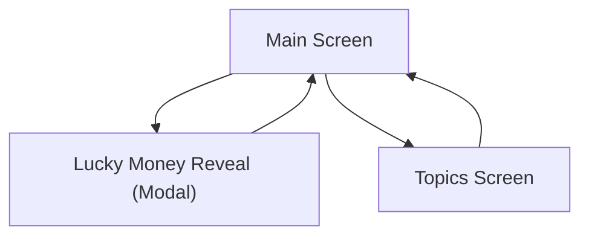

## 1. Product Overview
A lightweight Tet-themed web app with a main screen offering two actions: reveal a random “lucky money” amount, or explore conversation topics that surface random questions.
Built for quick fun and fast navigation with minimal friction.

## 2. Core Features

### 2.1 Feature Module
1. **Main Screen**: two primary clickable elements, lucky money reveal interaction, navigation to topics.
2. **Topics Screen**: topic selection, random question display per topic, refresh to get another random question.

### 2.3 Page Details
| Page Name | Module Name | Feature description |
|-----------|-------------|---------------------|
| Main Screen | Primary actions | Show exactly two prominent clickable elements: (1) “Lucky Money” and (2) “Topics”. |
| Main Screen | Lucky money reveal | Reveal a randomly generated lucky money value when “Lucky Money” is clicked; present result clearly (e.g., modal/card) and allow closing/dismissing to return to the main state. |
| Main Screen | Navigation | Navigate to Topics Screen when “Topics” is clicked. |
| Topics Screen | Topic list | Display a list/grid of available topics; allow selecting one topic at a time. |
| Topics Screen | Random question per topic | When a topic is selected, show one randomly chosen question belonging to that topic; allow re-rolling to show another random question for the currently selected topic. |
| Topics Screen | Back navigation | Provide a clear way to return to Main Screen. |

## 3. Core Process
**User Flow (single user role)**
1. You land on the Main Screen.
2. You click “Lucky Money” to reveal a random amount; you dismiss/close the result to return to the Main Screen.
3. You click “Topics” to go to the Topics Screen.
4. You select a topic to see a random question; you optionally re-roll to get another random question for the same topic.
5. You return to the Main Screen.

