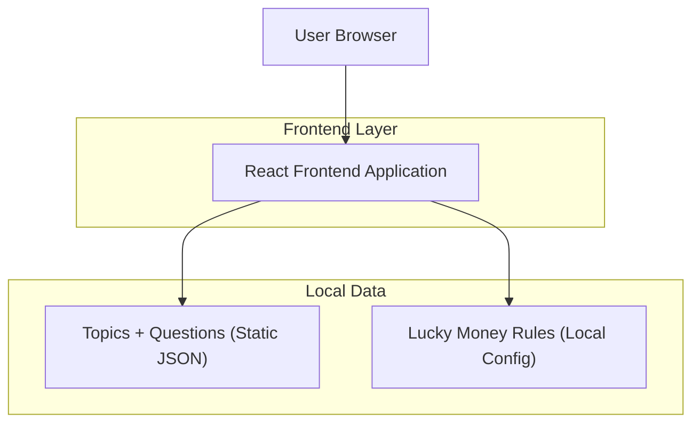

## 1.Architecture design

## 2.Technology Description
- Frontend: React@18 + vite + TypeScript + tailwindcss@3
- Backend: None (all logic and data bundled in the frontend)

## 3.Route definitions
| Route | Purpose |
|-------|---------|
| / | Main screen with two primary actions (lucky money reveal, topics navigation) |
| /topics | Topics screen to select a topic and view random questions |
